# Frontend Mentor - Space tourism website solution

This is a solution to the [Space tourism website challenge on Frontend Mentor](https://www.frontendmentor.io/challenges/space-tourism-multipage-website-gRWj1URZ3). Frontend Mentor challenges help you improve your coding skills by building realistic projects. 

## Table of contents

- [Overview](#overview)
  - [The challenge](#the-challenge)
  - [Screenshot](#screenshot)
  - [Links](#links)
- [My process](#my-process)
  - [Built with](#built-with)
  - [What I learned](#what-i-learned)
  - [Continued development](#continued-development)
  - [Useful resources](#useful-resources)
- [Author](#author)

## Overview

### The challenge

Users should be able to:

- View the optimal layout for each of the website's pages depending on their device's screen size
- See hover states for all interactive elements on the page
- View each page and be able to toggle between the tabs to see new information

### Screenshot

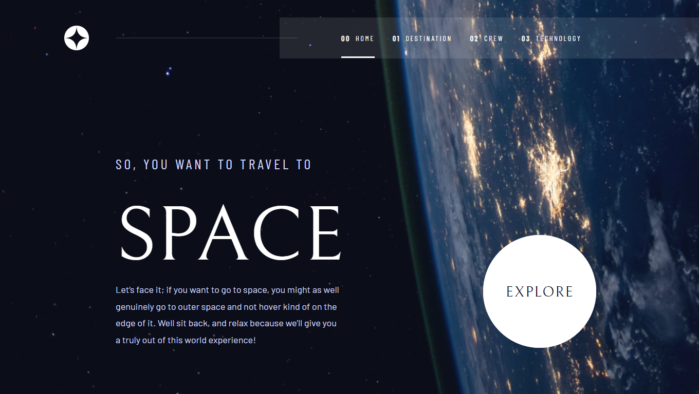
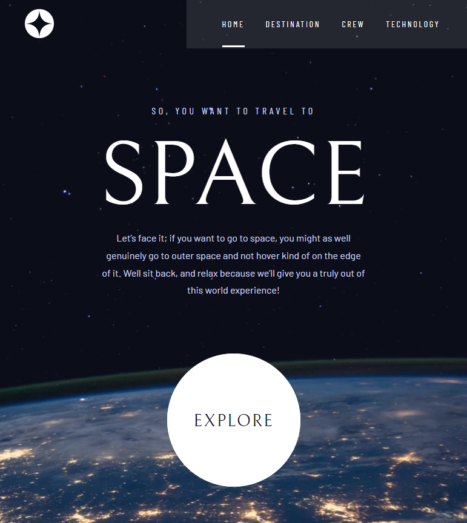
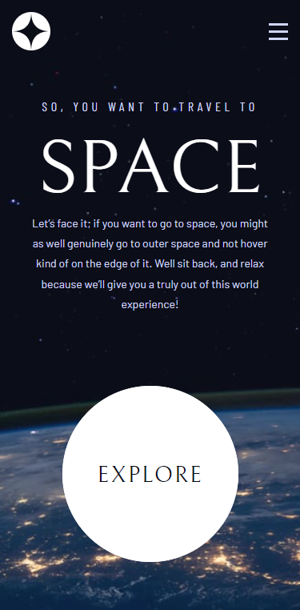
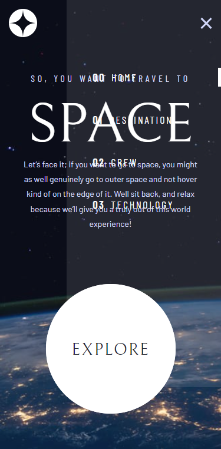
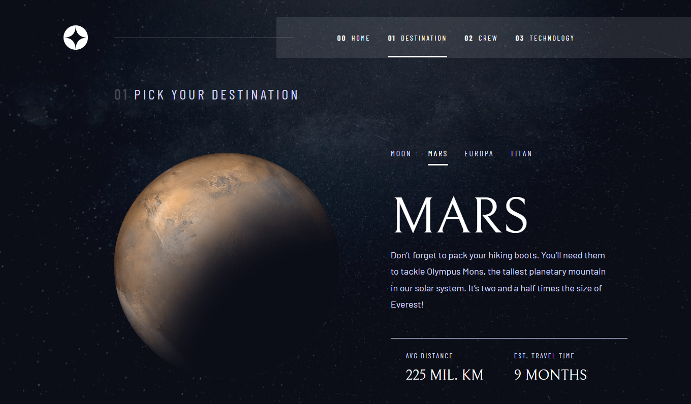
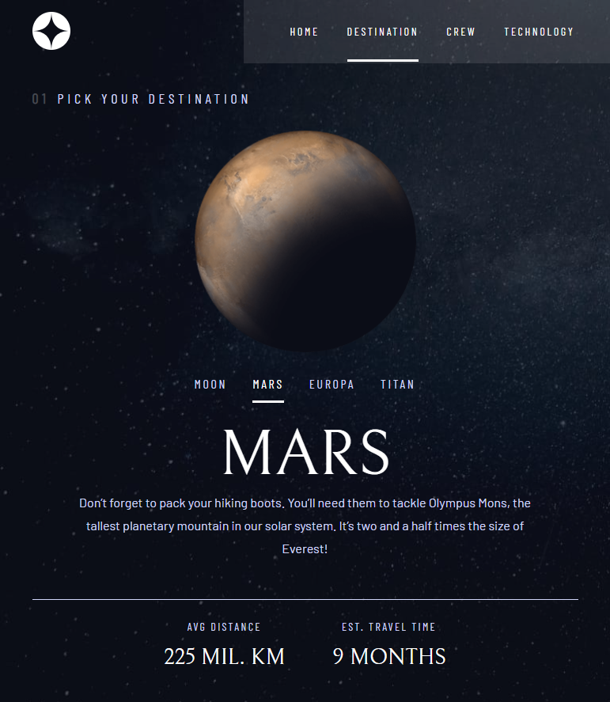
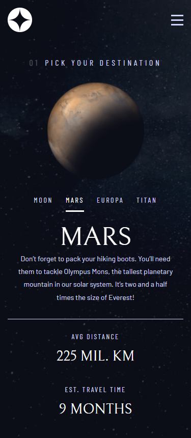
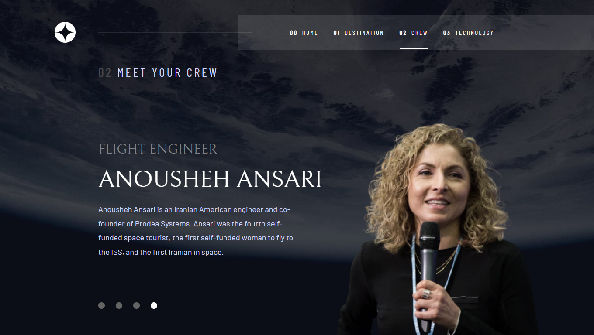
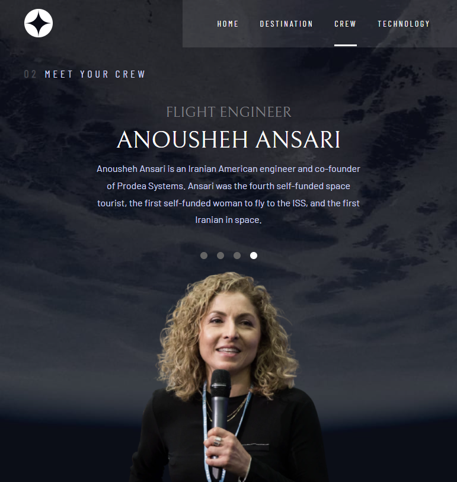
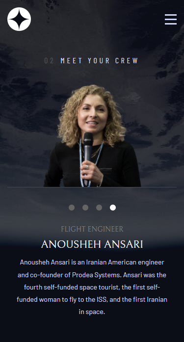
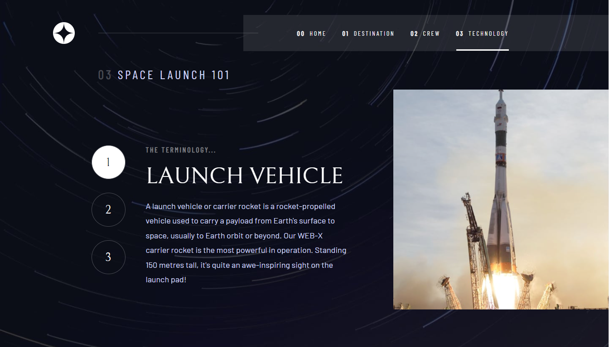
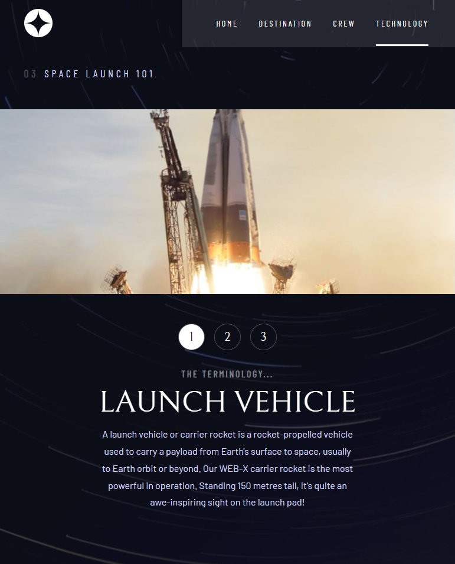
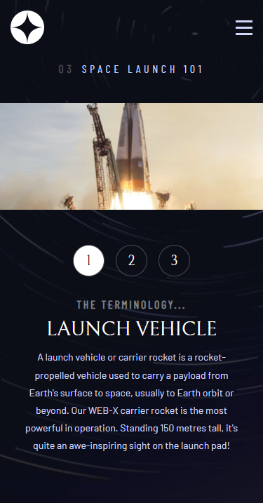

### Links

- Solution URL: [Space Tourism Website Main Frontend Mentor Solution](https://github.com/MohMostafa-Web/space-tourism-website-main-frontend-mentor)
- Live Site URL: [Space Tourism Website Main Live Site](https://mohmostafa-web.github.io/space-tourism-website-main-frontend-mentor/)

## My process

### Built with

- Semantic HTML5 markup
- Sass custom properties [Varaibles, Mixins , Media Queries, Components]
- Flexbox
- CSS Grid
- Mobile-first workflow
- Pure JS

### What I learned

- It's a good practice to create multiple pages using Sass

- Also very useful to practice on making responsive designs

### Continued development

In the future, I will use more css preprocessors like sass and more frameworks like bootstrap, angula or react js.

### Useful resources

- [youtube playlist (Create Web Design With Sass)](https://www.youtube.com/playlist?list=PLDoPjvoNmBAz9sluuyOWPifXvySgrGma8) - This is an amazing channel which helped me and this playlist helped me to understand Sass. I'd recommend it to anyone still learning this channel.

## Author

- Linkedin - [Mohamed Mostafa](https://www.linkedin.com/in/mohamed-mostafa-4a08aa1a2/)
- Frontend Mentor - [@MohMostafa-Web](https://www.frontendmentor.io/profile/MohMostafa-Web)
- Github - [@MohMostafa-Web](https://github.com/MohMostafa-Web)
